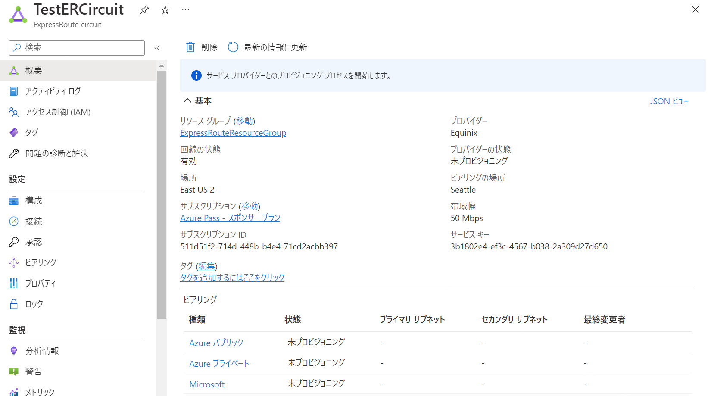

---
Exercise:
    title: 'M03-ユニット 5 ExpressRoute 回線のプロビジョニング'
    module: 'モジュール - Azure ExpressRoute の設計と実装'
---
# M03-ユニット 5 ExpressRoute 回線のプロビジョニング

この演習では、Azure portal と Azure Resource Manager デプロイ モデルを使用して ExpressRoute 回線を作成します。 


<!-- ExpressRoute 回線を作成する方法のデモを見るには、[Azure ExpressRoute - ExpressRoute 回線を作成する方法](https://channel9.msdn.com/Blogs/Azure/Azure-ExpressRoute-How-to-create-an-ExpressRoute-circuit?term=ExpressRoute&lang-en=true&pageSize=15&skip=15)を参照してください[ | Azure | Channel 9 (msdn.com)](https://channel9.msdn.com/Blogs/Azure/Azure-ExpressRoute-How-to-create-an-ExpressRoute-circuit?term=ExpressRoute&lang-en=true&pageSize=15&skip=15)。
-->

この演習では、次のことを行います。

+ タスク 1: ExpressRoute 回線の作成とプロビジョニング
+ タスク 2: サービス キーの取得
+ タスク 3: ExpressRoute 回線のプロビジョニング解除
+ タスク 4: リソースをクリーン アップする


## タスク 1: ExpressRoute 回線の作成とプロビジョニング

 

1. ブラウザーから [Azure portal](https://portal.azure.com/) に移動し、Azure アカウントでサインインします。

   > [!重要] 
   >
   > ExpressRoute 回線の課金は、サービス キーが発行されたときから始まります。接続プロバイダーが回線をプロビジョニングする準備ができたら、この操作を実行します。

2. Azure portal のメニューで、「**+ リソースの作成**」を選択します。次の図に示すように、「**ネットワーク**」を選択してから、「**ExpressRoute circuits**」を選択します。ExpressRoute circuits がリストに表示されない場合は、「**マーケットプレイスの検索**」を使用して検索します。

   

3. 「**ExpressRoute circuits の作成**」ページで、回線の**リソース グループ**、**リージョン**、**名前**を次のように指定します。ExpressRouteResourceGroup、East US 2、TestERCircuit。次に、「**次: Configuration >**」を選択します。

4. このページで値を入力するときは、正しい SKU レベル (Local、Standard、または Premium) とデータ計測課金モデル (無制限または従量制) を必ず指定してください。


 

- 「ポートの種類」により、サービス プロバイダーに接続するか、またはピアリングの場所で Microsoft のグローバル ネットワークに直接接続するかが決まります。
- 「新規作成またはクラシックからインポート」により、新しい回線を作成するか、または従来の回線を Azure Resource Manager に移行するかが決まります。
- 「プロバイダー」は、サービスの要求先となるインターネット サービス プロバイダーです。
- ピアリングの場所とは、Microsoft とピアリングしている物理的な場所です。

> [!重要]
>
> ピアリングの場所は、Microsoft とピアリングしている[物理的な場所](https://docs.microsoft.com/ja-jp/azure/expressroute/expressroute-locations)を示します。この場所は "Location" プロパティにリンクされていません。それは、Azure Network Resource Provider が配置されている地理的な場所を参照します。それらは関連付けられていませんが、回路のピアリングの場所と地理的に近い場所にある Network Resource Provider を選択することをお勧めします。

- 「**SKU**」によって、ExpressRoute Local、ExpressRoute Standard、または ExpressRoute Premium のどのアドオンを有効にするかが決まります。ローカルの SKU を取得する場合は「**Local**」、標準の SKU を取得する場合は「**Standard**」、Premium アドオンの場合は「**Premium**」を指定できます。SKU を変更し、プレミアム アドオンを有効にすることができます。

> [!重要]
>
> SKU を「Standard」または「Premium」から「Local」に変更することはできません。

- 「**課金モデル**」により、課金の種類が決まります。従量制課金データ プランの場合は「**従量制**」を、無制限データ プランの場合は「**無制限**」を指定できます。課金の種類を「**従量制**」から「**無制限**」に変更することができます。

> [!重要]
>
> 種類を「無制限」から「従量制」に変更することはできません。

- 「**クラシック操作を許可する**」により、従来の仮想ネットワークを回線にリンクすることができます。

## タスク 2: サービス キーの取得
 

1. 左側のメニューで **「すべてのサービス」 > 「ネットワーク」 > 「ExpressRoute 回線」** を選択すると、作成したすべての回線を表示できます。

   

2. サブスクリプション内で作成されたすべての ExpressRoute 回線がここに表示されます。 

   

3. 回路ページには、回路のプロパティが表示されます。サービス キーがサービス キー フィールドに表示されます。サービス プロバイダーは、プロビジョニング プロセスを完了するためにサービス キーが必要になります。サービス キーは回線に固有です。**プロビジョニングのためにサービス キーを接続プロバイダーに送信する必要があります。**

   

4. このページの「**プロバイダーの状態**」には、サービス プロバイダー側でのプロビジョニングの現在の状態が表示されます。「**回線の状態**」は、Microsoft 側での状態を提供します。 

5. 新しい ExpressRoute 回線を作成する場合、この回線は次の状態になります。

   - プロバイダーの状態: 未プロビジョニング
   - 回線の状態: Enabled


   - 回線は、接続プロバイダーが有効にしている間、次の状態に変化します。
     - プロバイダーの状態: プロビジョニング
     - 回線の状態: Enabled
   - ExpressRoute 回線を使用するには、次の状態になっている必要があります。
     - プロバイダーの状態: Provisioned
     - 回線の状態: Enabled
   - プロビジョニングの状態と回線ステータスの状態を定期的に確認する必要があります。


 
ExpressRoute 回線を作成およびプロビジョニングする方法のこのデモをご覧ください。[Azure ExpressRoute - ExpressRoute 回線の作成方法 | Azure | Channel 9 (msdn.com)](https://channel9.msdn.com/Blogs/Azure/Azure-ExpressRoute-How-to-create-an-ExpressRoute-circuit?term=ExpressRoute&lang-en=true&pageSize=15&skip=15)。 

お疲れさまでした! ExpressRoute 回線を作成し、回線のプロビジョニングを完了するために必要なサービス キーを見つけました。

## タスク 3: ExpressRoute 回線のプロビジョニング解除

ExpressRoute 回線サービス プロバイダーのプロビジョニング状態が**プロビジョニング中**または**プロビジョニング済み**の場合、サービス プロバイダー側の回線のプロビジョニングを解除するには、サービス プロバイダーに連絡する必要があります。Microsoft は、サービス プロバイダーが回線のプロビジョニング解除を完了し、通知するまで、リソースの予約と課金を続行します。

> [!注]
>
> プロビジョニングを解除する前に、ExpressRoute 回線からすべての仮想ネットワークのリンクを解除する必要があります。この操作が失敗した場合は、回線にリンクされている仮想ネットワークがないか確認してください。
>
> サービス プロバイダーが回線のプロビジョニングを解除済みの場合 (サービス プロバイダーのプロビジョニング状態が未プロビジョニングに設定されている場合)、回線を削除することができます。これによって回線の課金が停止されます。

## タスク 4: リソースをクリーン アップする

「**削除**」アイコンを選択し、ExpressRoute 回線を削除できます。続行する前に、プロバイダーのステータスが確実に未プロビジョニングになっているようにします。


   > **注**: 新しく作成した Azure リソースのうち、使用しないリソースは必ず削除してください。使用しないリソースを削除しないと、予期しないコストが発生する場合があります。

1. Azure portal の **「Cloud Shell」** ウィンドウで **「PowerShell」** セッションを開きます。

1. 次のコマンドを実行して、このモジュールのラボ全体で作成したすべてのリソース グループのリストを削除します。

   ```powershell
   Remove-AzResourceGroup -Name 'ContosoResourceGroup' -Force -AsJob
   Remove-AzResourceGroup -Name 'ExpressRouteResourceGroup' -Force -AsJob
   ```
   > **注**: コマンドは非同期で実行されるので (-AsJob パラメーターによって決定されます)、別の PowerShell コマンドを同一 PowerShell セッション内ですぐに実行できますが、リソース グループが実際に削除されるまでに数分かかります。


