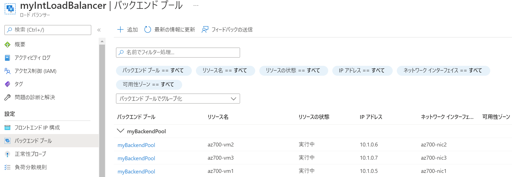

---
Exercise:
    title: 'M04-ユニット 4 Azure のロード バランサーを作成し、構成する'
    module: 'モジュール ? Azure での非 HTTP(S) トラフィックの負荷分散'
---


# M04-ユニット 4 Azure のロード バランサーを作成し、構成する

この演習では、架空の Contoso Ltd 組織の内部ロード バランサーを作成します。 

内部ロード バランサーを作成する手順は、パブリック ロード バランサーを作成するために、このモジュールですでに学習した手順と非常によく似ています。主な違いは、パブリック ロード バランサーを使用すると、フロントエンドにパブリック IP アドレスを介してアクセスし、仮想ネットワークの外部にあるホストからの接続をテストすることです。 一方、内部ロード バランサーでは、フロントエンドは仮想ネットワーク内のプライベート IP アドレスであり、同じネットワーク内のホストからの接続をテストします。

次の図は、この演習でデプロイする環境を示しています。


 
この演習では、次のことを行います。

+ タスク 1: 仮想ネットワークを作成する
+ タスク 2: バックエンド サーバーを作成する
+ タスク 3: ロード バランサーを作成する
+ タスク 4: ロード バランサー リソースを作成する
+ タスク 5: ロード バランサーをテストする

## タスク 1: 仮想ネットワークを作成する

このセクションでは、仮想ネットワークとサブネットを作成します。
   
1. Azure portal にログインします。

2. Azure portal の「ホーム」ページで、「グローバル検索」バーに移動して、「**仮想ネットワーク**」を検索し、サービスの下で、仮想ネットワークを選択します。 <!--  -->

3. 「仮想ネットワーク」ページで、「**作成**」を選択します。 <!-- -->

4. **「基本」** タブで、次の表の情報を使用して仮想ネットワークを作成します。

   | **設定**    | **値**                                  |
   | -------------- | ------------------------------------------ |
   | サブスクリプション   | サブスクリプションを選択します                   |
   | リソース グループ | **「新しい名前の作成」** を選択する: **IntLB-RG** |
   | 名前           | **IntLB-VNet**                             |
   | リージョン         | **East US**                           |


5. **「次へ: IP アドレス**」をクリックします。

6. **「IP アドレス」** タブの **「IPv4 アドレス空間」** ボックスで、既定値を削除し、**「10.1.0.0/16」** と入力します。

7. 「**IP アドレス**」タブで、「**+ サブネットの追加**」を選択します。

8. 「**サブネットの追加**」ペインで、**「myBackendSubnet」** のサブネット名と **「10.1.0.0/24」** のサブネット アドレス範囲を指定します。

9. 「**追加**」をクリックします。

10. **「サブネットの追加」** で、**「myFrontEndSubnet」** のサブネット名と **「10.1.2.0/24」** のサブネット アドレス範囲を指定します。**「追加」** をクリックします。

11. **「次へ: セキュリティ**」をクリックします。

12. **「BastionHost」** で、**「有効化」** を選択し、以下の表の情報を入力します。

    | **設定**                       | **値**                                     |
    | --------------------------------- | --------------------------------------------- |
    | Bastion 名                      | **myBastionHost**                             |
    | AzureBastionSubnet のアドレス空間 | **10.1.1.0/24**                               |
    | パブリック IP アドレス                 | **「新しい名前の作成」** を選択する: **myBastionIP** |


13. **「確認および作成」** をクリックします。

14. **「作成」** をクリックします。

## タスク 2: バックエンド サーバーを作成する

このセクションでは、ロード バランサーのバックエンド プール用に同じ可用性セットに含まれる 3 つの VM を作成し、VM をバックエンド プールに追加してから、3 つの VM に IIS をインストールしてロード バランサーをテストします。

1. Azure portal の **「Cloud Shell」** ウィンドウで **「PowerShell」** セッションを開きます。

2. Cloud Shell ウィンドウのツールバーで、「ファイルのアップロード/ダウンロード」アイコンをクリックし、ドロップダウン メニューで「アップロード」をクリックして、
- azuredeploy.json
- azuredeploy.parameters.vm1.json
- azuredeploy.parameters.vm2.json
- azuredeploy.parameters.vm3.json

 ファイルを Cloud Shell のホーム ディレクトリにアップロード配置します。

3. 次の ARM テンプレートをデプロイして、この演習に必要な仮想ネットワーク、サブネット、VM を作成します。

   ```powershell
   $RGName = "IntLB-RG"
   
   New-AzResourceGroupDeployment -ResourceGroupName $RGName -TemplateFile azuredeploy.json.json -TemplateParameterFile azuredeploy.parameters.vm1.json
   New-AzResourceGroupDeployment -ResourceGroupName $RGName -TemplateFile azuredeploy.json.json -TemplateParameterFile azuredeploy.parameters.vm2.json
   New-AzResourceGroupDeployment -ResourceGroupName $RGName -TemplateFile azuredeploy.json.json -TemplateParameterFile azuredeploy.parameters.vm3.json
   ```
> コマンドでの実行に失敗する場合は、**カスタム テンプレートからのデプロイ**から、**「エディターで独自のテンプレートを作成する」** を選択し、ファイルの読み込みから、「azuredeploy.json.json」を選択して保存します。その後、「パラメータの編集」をクリックし、「azuredeploy.parameters.vm1.json」を選択して保存します。パラメーターを確認して空白があればそれを補完し、デプロイを行います。同様の操作をazuredeploy.parameters.vm2.json、azuredeploy.parameters.vm3.json ファイルに対して行います。

## タスク 3: ロード バランサーを作成する

このセクションでは、内部 Standard SKU ロード バランサーを作成します。この演習で、Basic SKU ロード バランサーの代わりに Standard SKU ロード バランサーを作成する理由は、ロードバランサーの Standard SKU バージョンを必要とする後の演習のためです。

1. Azure portal のホーム ページで、**「リソースの作成」** をクリックします。

2. ページ上部の検索ボックスに、**「Load Balancer」** と入力し、**Enter** キーを押します (**注:** リストから 1 つを選択しないでください)。

3. 「結果」ページで、「**ロード バランサー**」 (名前の下に「Microsoft」と「Azure Service」と表示されているもの) を探して選択します。

4. **「作成」** をクリックします。
   

5. **「基本」** タブで、次の表の情報を使用してロード バランサーを作成します。

   | **設定**           | **値**                |
   | --------------------- | ------------------------ |
   | サブスクリプション          | サブスクリプションを選択します |
   | リソース グループ        | **IntLB-RG**             |
   | 名前                  | **myIntLoadBalancer**    |
   | 地域(リージョン)                | **East US**         |
   | SKU                   | **Standard**             |
   | 種類                  | **内部**             |
   | レベル                   | **地域**             |


6. 「**次へ: フロントエンド IP 構成**」をクリックします。
7. 「フロントエンド IP の追加」をクリックします
8. **「フロントエンド IP 構成の追加」** ブレードで、次の表の情報を入力します。
 
   | **設定**     | **値**                |
   | --------------- | ------------------------ |
   | 名前            | **LoadBalancerFrontEnd** |
   | 仮想ネットワーク | **IntLB-VNet**           |
   | サブネット          | **myFrontEndSubnet**     |
   | 割り当て      | **動的**              |
   | 可用性ゾーン      | **ゾーンなし**              |

9. **「確認および作成」** をクリックします。

10. **「作成」** をクリックします。

## タスク 4: ロード バランサー リソースを作成する

このセクションでは、バックエンド アドレス プールのロード バランサー設定を構成してから、正常性プローブとロード バランサー規則を作成します。

### バックエンド プールを作成し、VM をバックエンド プールに追加する

バックエンド アドレス プールには、ロード バランサーに接続された仮想 NIC の IP アドレスが含まれています。

1. Azure portal のホーム ページで、**「すべてのリソース」** をクリックしてから、リソース一覧から **「myIntLoadBalancer」** をクリックします。

2. **「設定」** で、**「バックエンド プール」** を選択してから、**「追加」** をクリックします。

3. **「バックエンド プールの追加」** ブレードで、次の表の情報を入力します。

   | **設定**     | **値**            |
   | --------------- | -------------------- |
   | 名前            | **myBackendPool**    |
   | 仮想ネットワーク | **IntLB-VNet**       |


4. **「仮想マシン」** で、**「追加」** をクリックします。

5. 3 つのVM (**az700-vm1**、**az700-vm2**、**az700-vm3**) すべてのチェックボックスを選択し、**「追加」** をクリックします。

6. **「追加」** をクリックします。
   
   

### 正常性プローブを作成する

ロード バランサーは、正常性プローブを使用してアプリの状態を監視します。正常性プローブは、正常性チェックへの応答に基づいて、ロード バランサーに含める VM を追加したり削除したりします。ここでは、VM の正常性を監視するための正常性プローブを作成します。

1. **「設定」** で **「正常性プローブ」** をクリックしてから、**「追加」** をクリックします。

2. **「正常性プローブの追加」** ブレードで、次の表の情報を入力します。

   | **設定**         | **値**         |
   | ------------------- | ----------------- |
   | 名前                | **myHealthProbe** |
   | プロトコル            | **HTTP**          |
   | ポート                | **80**            |
   | パス                | **/**             |
   | 間隔            | **15**            |
   | 異常しきい値 | **2**             |


3. **「追加」** をクリックします。
   

 

### ロード バランサー規則の作成

ロード バランサー規則の目的は、一連の VM に対するトラフィックの分散方法を定義することです。着信トラフィック用のフロントエンド IP 構成と、トラフィックを受信するためのバックエンド IP プールを定義します。送信元と送信先のポートは、この規則で定義します。ここでは、ロードバランサー規則を作成します。

1. ロード バランサーの **「負荷分散規則」** をクリックしてから、**「追加」** をクリックします。

2. **「負荷分散規則の追加」** ブレードで、次の表の情報を入力します。

   | **設定**            | **値**                |
   | ---------------------- | ------------------------ |
   | 名前                   | **myHTTPRule**           |
   | IP バージョン             | **IPv4**                 |
   | フロントエンド IP アドレス    | **LoadBalancerFrontEnd** |
   | バックエンド プール           | **myBackendPool**        |
   | プロトコル               | **TCP**                  |
   | ポート                   | **80**                   |
   | バックエンド ポート           | **80**                   |

   | 正常性プローブ           | **myHealthProbe**        |
   | セッション永続化    | **なし**                 |
   | アイドル タイムアウト (分) | **15**                   |
   | フローティング IP            | **無効**             |


3. **「追加」** をクリックします。
   

 


 

 

## タスク 5: ロード バランサーをテストする

このセクションでは、テスト VM を作成してから、ロード バランサーをテストします。

### テスト VM の作成

1. Azure portal のホーム ページで、**「リソースの作成」**、**「コンピューティング」** の順にクリックし、**「Virtual Machines」** を選択します (このリソースの種類がページに表示されていない場合は、ページ上部の検索ボックスを使用して検索し、選択します)。

2. **「Virtual Machines」** ページの **「基本」** タブで、次の表の情報を使用して最初の VM を作成します。

   | **設定**          | **値**                                    |
   | -------------------- | -------------------------------------------- |
   | サブスクリプション         | サブスクリプションを選択します                     |
   | リソース グループ       | **IntLB-RG**                                 |
   | 仮想マシン名 | **myTestVM**                                 |
   | リージョン               | **(US) East US**                             |
   | 可用性オプション | **インフラストラクチャの冗長性は必要ありません**    |
   | イメージ                | **Windows Server 2022 Datacenter - Gen 2**   |
   | サイズ                 | **Standard_DS1_v2 - 1 vCpu、3.5 GiB メモリ** |
   | ユーザー名             | **TestUser**                                 |
   | パスワード             | **TestPa$$w0rd!**                            |
   | パスワードの確認     | **TestPa$$w0rd!**                            |


3. **「次へ: ディスク**」をクリックしてから、「**次へ: ネットワーク**」をクリックします。 

4. **「ネットワーク」** タブで、次のの表の情報を使用して、ネットワーク設定を構成します。

   | **設定**                                                  | **値**                     |
   | ------------------------------------------------------------ | ----------------------------- |
   | 仮想ネットワーク                                              | **IntLB-VNet**                |
   | サブネット                                                       | **myBackendSubnet**           |
   | パブリック IP                                                    | **「なし」** に変更する            |
   | NIC ネットワーク セキュリティ グループ                                   | **詳細**                  |
   | ネットワーク セキュリティ グループを構成する                             | 既存の **「myNSG」** を選択する |
   | この仮想マシンを既存の負荷分散ソリューションの背後に配置しますか?  | **オフ** (未チェック)           |


5. **「確認および作成」** をクリックします。

6. **「作成」** をクリックします。

7. この最後の VM がデプロイされるのを待ってから、次のタスクに進みます。

### テスト VM に接続して、ロード バランサーをテストする

1. Azure portal のホーム ページで、**「すべてのリソース」** をクリックしてから、リソース一覧から **「myIntLoadBalancer」** をクリックします。

2. 「**概要**」ページで、**プライベート IP アドレス**をメモするか、クリップボードにコピーします。注: 「**プライベート IP アドレス**」フィールドを表示するために、「**もっと見る**」を選択することが必要となる場合があります。

3. **「ホーム」** をクリックし、Azure portal のホーム ページで、**「すべてのリソース」** をクリックしてから、作成した **myTestVM** 仮想マシンをクリックします。

4. **「概要」** ページで、**「接続」**、**「Bastion」** の順に選択します。

5. **「Bastion を使用」** をクリックします。

6. **「ユーザー名」** ボックスに **「TestUser」** と入力し、**「パスワード」** ボックスに **「TestPa$$w0rd!」** と入力して、**「接続」** をクリックします。

7. **myTestVM** ウィンドウが別のブラウザー タブで開きます。

8. **「ネットワーク」** ウィンドウが表示されたら、**「はい」** をクリックします。

9. メニューの **「Microsoft Edge」** アイコンをクリックして、Web ブラウザーを開きます。

10. **「Welcome to the new Microsoft Edge」** ダイアログ ボックスで **「Get started」** をクリックします。

11. 前の手順の**プライベート IP アドレス** (例: 10.1.0.4) をブラウザーのアドレス バーに入力 (または貼り付け) して、Enter キーを押します。

12. IIS Web サーバーの既定の Web ホーム ページがブラウザー ウィンドウに表示されます。バックエンド プール内の 3 つの仮想マシンの 1 つが応答します。
    

13. ブラウザーの更新ボタンを数回クリックすると、内部ロード バランサーのバックエンド プール内のさまざまな VM からランダムに応答が返されることがわかります。
    

> VMが切り替わらない場合は、InPrivate ウインドウを開いて別セッションとして再度接続してみてください。

## リソースをクリーン アップする

   > **注**: 新しく作成した Azure リソースのうち、使用しないリソースは必ず削除してください。使用しないリソースを削除しないと、予期しないコストが発生する場合があります。

1. Azure portal の **「Cloud Shell」** ウィンドウで **「PowerShell」** セッションを開きます。

1. 次のコマンドを実行して、このモジュールのラボ全体で作成したすべてのリソース グループのリストを削除します。

   ```powershell
   Remove-AzResourceGroup -Name 'IntLB-RG' -Force -AsJob
   ```

    > **注**: コマンドは非同期で実行されるので (-AsJob パラメーターによって決定されます)、別の PowerShell コマンドを同一 PowerShell セッション内ですぐに実行できますが、リソース グループが実際に削除されるまでに数分かかります。
