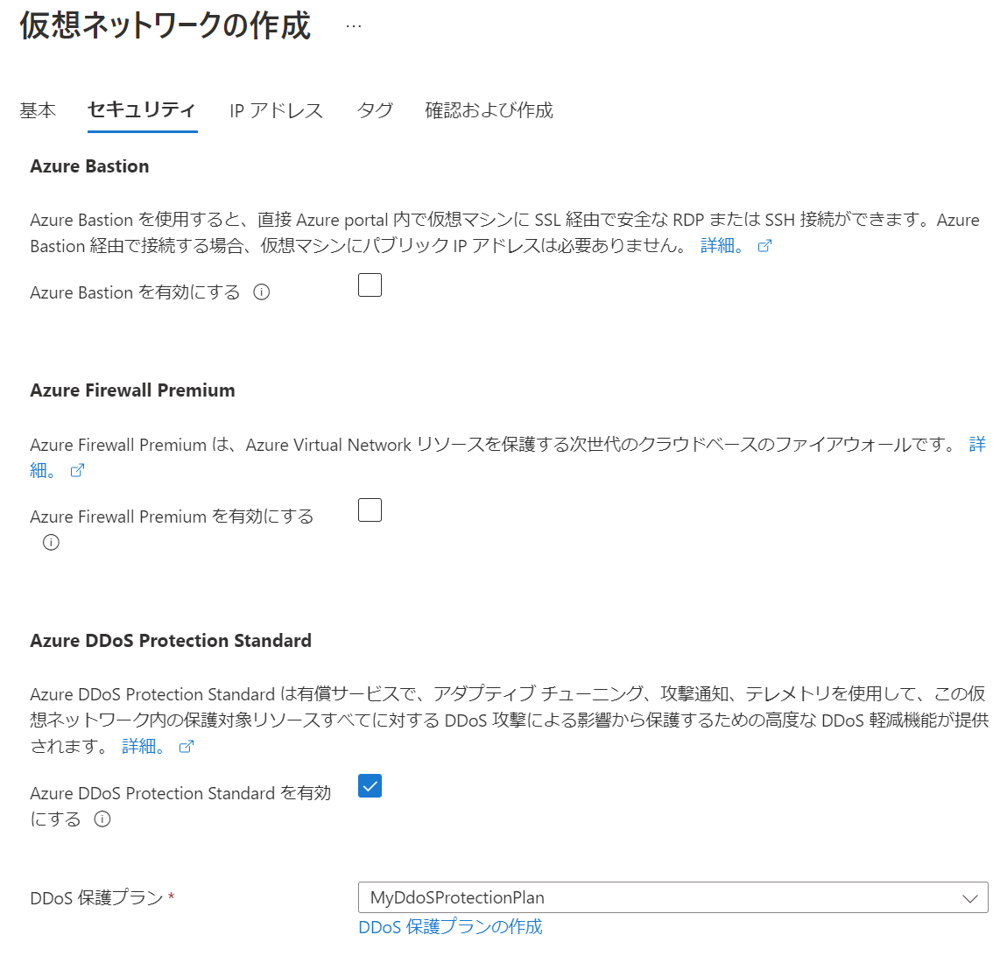
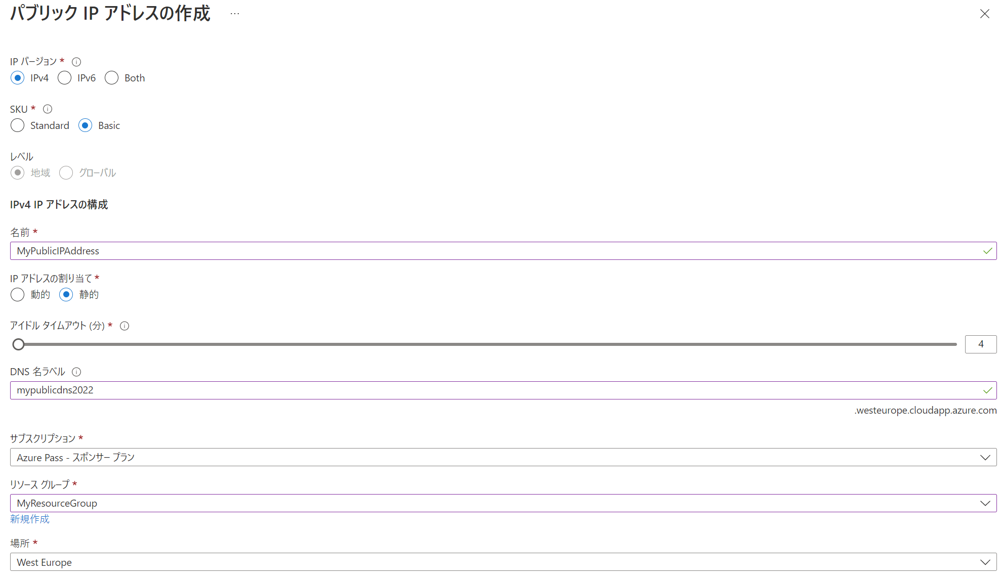
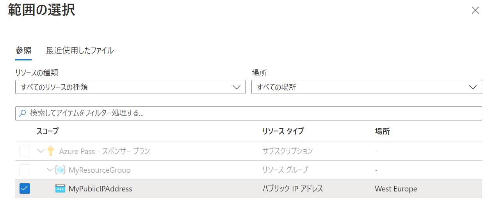
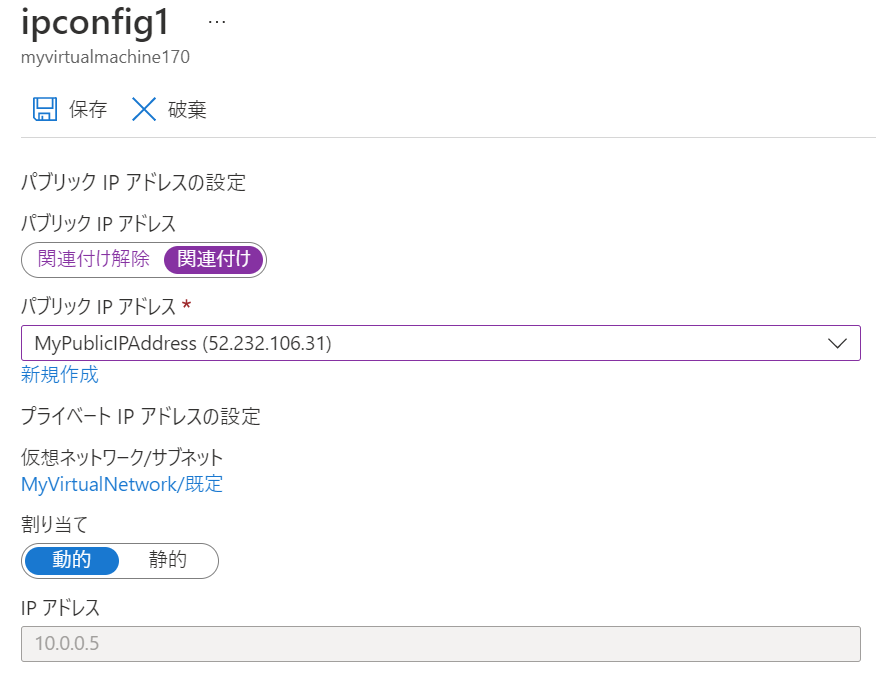
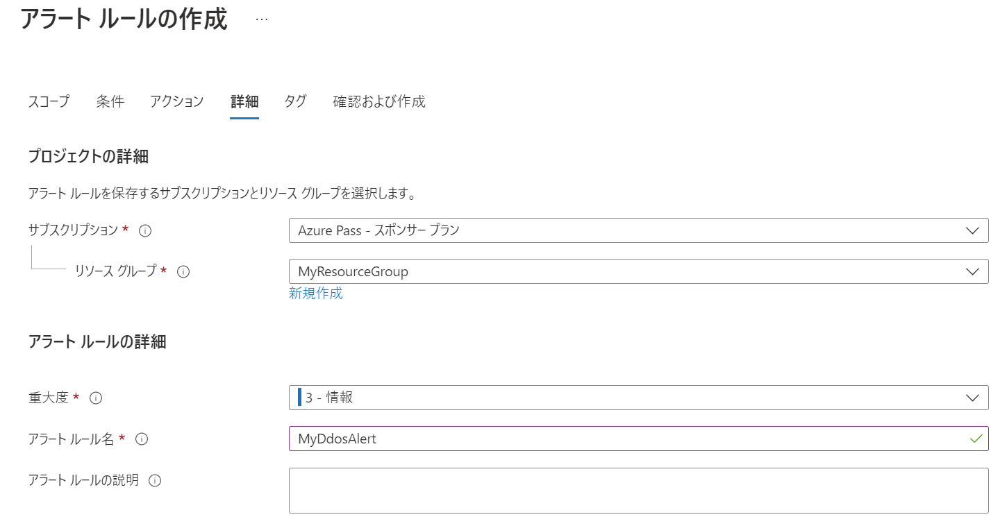

---
Exercise:
    title: 'M06-ユニット 4 Azure portal を使用して仮想ネットワーク上に DDoS Protection を構成する'
    module: 'モジュール - ネットワーク セキュリティの設計と実装'
---

# M06-ユニット 4 Azure portal を使用して仮想ネットワーク上に DDoS Protection を構成する

Contoso のネットワーク セキュリティチームを担当し、仮想ネットワークに対して模擬 DDoS 攻撃を実行します。次の手順では、仮想ネットワークの作成、DDoS 保護の構成、テレメトリとメトリックを使用して観察および監視できる攻撃の作成について説明します。

この演習では、次のことを行います。

+ タスク 1: リソース グループを作成する
+ タスク 2: DDoS Protection プランを作成する
+ タスク 3: 新しい仮想ネットワークの DDoS Protection を有効にする
+ タスク 4: DDoS テレメトリを構成する
+ タスク 5: DDoS 診断ログを構成する
+ タスク 6: DDoS アラートを構成する
+ タスク 7: DDoS サービス要求を送信して DDoS 攻撃を実行する
+ タスク 8: リソースをクリーン アップする


## タスク 1: リソース グループを作成する

1. Azure アカウントにログインします。

2. Azure portal のホーム ページで、「**リソース グループ**」を選択します。

3. 「**作成**」をクリックします。 

4. 「**基本**」タブの「**リソース グループ**」に、「**MyResourceGroup**」と入力します。

   

5. 「**リージョン**」で、**「(Europe）West Europe」** 一覧からリージョンを選択します。

6. 「**確認および作成**」をクリックします。

7. 「**作成**」をクリックします。

   

 

## タスク 2: DDoS Protection プランを作成する

1. Azure portal のホーム ページで、検索ボックスに「**DDoS**」と入力して、表示されたら「**DDoS 保護プラン**」をクリックします。

2. **「+ 作成」** をクリックします。

3. 「**基本**」タブの「**リソース グループ**」リストで、作成したリソース グループを選択します。

4. 「**インスタンス名**」ボックスに「**MyDdoSProtectionPlan**」と入力し、「**地域**」で、**「(Europe）West Europe」** を選択します。「**確認および作成**」をクリックします。 

   

5. 「**作成**」をクリックします。

 

## タスク 3: 新しい仮想ネットワークの DDoS Protection を有効にする

ここでは、既存の仮想ネットワークではなく新しい仮想ネットワークで DDoS を有効にするため、最初に新しい仮想ネットワークを作成してから、前に作成した計画を使用して DDoS Protection を有効にする必要があります。

1. Azure portal のホーム ページで「**リソースの作成**」を選択し、検索ボックスに「**仮想ネットワーク**」と入力して、表示されたら「**仮想ネットワーク**」をクリックします。

   

2. 「**仮想ネットワーク**」ページで、「**作成**」をクリックします。

3. 「**基本**」タブで、前に作成したリソース グループを選択します。

4. 「**名前**」ボックスに「**MyVirtualNetwork**」と入力し、「**地域**」で、**「(Europe）West Europe」** を選択します。「**セキュリティ**」タブをクリックします。 

   

5. 「**セキュリティ**」タブの「**DDoS Protection Standard**」の横にある「**有効にする**」を選択します。

6. 「**DDoS Protection プラン**」ドロップダウン リストで、「**MyDdosProtectionPlan**」を選択します。

   

7. 「**確認および作成**」をクリックします。

8. 「**作成**」をクリックします。

 

## タスク 4: DDoS テレメトリを構成する

パブリック IP アドレスを作成し、次の手順でテレメトリを設定します。

1. Azure portal のホーム ページで「**リソースの作成**」を選択し、検索ボックスに「**public ip**」と入力して、表示されたら「**パブリック IP アドレス**」をクリックします。

2. 「**パブリック IP アドレス**」ページで、「**作成**」をクリックします。

3. 「**パブリック IP アドレスの作成**」ページの「**SKU**」で、「**Basic**」を選択します。

4. 「**名前**」ボックスに「**MyPublicIPAddress**」と入力します。

5. 「**IP アドレスの割り当て**」で、「**静的**」を選択します。

6. 「**DNS 名ラベル**」に「**mypublicdnsxx**」と入力します (xx はこれを一意にするためのイニシャルです)。

7. 一覧で、リソース グループ「**MyResourceGroup**」を選択します。

   

8. 「**作成**」をクリックします。

9. Azure のホーム ページで、「**すべてのリソース**」をクリックします。

10. リソースの一覧で、「**MyDdosProtectionPlan**」をクリックします。

11. 「**監視**」で「**メトリック**」を選択します。

12. 「**スコープ**」ボックスを選択してから、「**MyPublicIPAddress**」の横にあるチェックボックスを選択します。

    

13. 「**適用**」をクリックします。

14. 「**メトリック**」ボックスで、「**Inbound packets dropped DDoS**」を選択します。

15. 「**集計**」ボックスで、「**最大値**」を選択します。

    

 

## タスク 5: DDoS 診断ログを構成する

1. Azure のホーム ページで、「**すべてのリソース**」をクリックします。

2. リソースの一覧で、「**MyPublicIPAddress**」をクリックします。

3. 「**監視**」で「**診断設定**」を選択します。

4. 「**診断設定を追加する**」をクリックします。 

5. 「**診断設定**」ページの「**診断設定名**」ボックスに、「**MyDiagnosticSetting**」と入力します。 

6. 「**カテゴリの詳細**」で、3 つの**ログ** チェックボックスすべてと「**AllMetrics**」チェックボックスを選択します。

7. 「**宛先の詳細**」で、「**Log Analytics ワークスペースへの送信**」チェック ボックスをオンにします。ここでは、既存の Log Analytics ワークスペースを選択できますが、診断ログの宛先をまだ設定していないため、設定を入力するだけで、この演習の次の手順でそれらを破棄します。

   

8. 通常は、「**保存**」をクリックして診断設定を保存します。設定の構成をまだ完了できないため、このオプションはまだグレー表示されていることに注意してください。

9. 「**破棄**」をクリックしてから、「**はい**」をクリックします。

 

## タスク 6: DDoS アラートを構成する

この手順では、仮想マシンを作成し、それにパブリック IP アドレスを割り当ててから、DDoS アラートを構成します。

### VM を作成する

1. Azure portal のホーム ページで「**リソースの作成**」を選択し、検索ボックスに「**Virtual Machines**」と入力して、表示されたら「**Virtual Machines**」をクリックします。

2. 「**Virtual Machines**」ページで、「**作成**」をクリックします。

3. 「**基本**」タブで、次の表の情報を使用して新しい VM を作成します。

   | **設定**           | **値**                                                    |
   | --------------------- | ------------------------------------------------------------ |
   | サブスクリプション          | サブスクリプションを選択します                                     |
   | リソース グループ        | **MyResourceGroup**                                          |
   | 仮想マシン名  | **MyVirtualMachine**                                         |
   | リージョン                | 自分のリージョン                                                  |
   | 可用性オプション  | **インフラストラクチャの冗長性は必要ありません**                   |
   | イメージ                 | **Ubuntu Server 18.04 LTS - Gen 2** (必要に応じて、「VM Generation の構成」リンクを選択します) |                     
   | サイズ                  | 「**すべてのサイズを表示**」を選択し、一覧で「**B1ls**」を選択して、「**選択**」を選択します **(Standard_B1ls-1 vcpu、0.5 GiBメモリ)** |
   | 認証の種類   | **SSH 公開キー**                                           |
   | ユーザー名              | **azureuser**                                                |
   | SSH 公開キーのソース | **新しいキーの組の生成**                                    |
   | キーの組名         | **myvirtualmachine-ssh-key**                                 |

> サブスクリプションの制限によって、B1lsのサイズがサポートされない場合は、利用可能なサイズを選択してください。


4. 「**確認および作成**」をクリックします。

5. 「**作成**」をクリックします。

   

6. 「**新しいキーの組の生成**」ダイアログ ボックスで、「**秘密キーをダウンロードとリソースの作成**」をクリックします。

7. 秘密キーを保存します。

8. デプロイが完了したら、「**リソースに移動**」をクリックします。

### パブリック IP アドレスを割り当てる

1. 新しい仮想マシンの「**概要**」ページの「**設定**」で、「**ネットワーク**」をクリックします。

2. 「**ネットワーク インターフェイス**」の横にある「**myvirtualmachine**」 (例: myvirtualmachine892) をクリックします。

3. 「**設定**」で「**IP 構成**」をクリックします。

4. 「**ipconfig1**」を選択します。

5. 「**パブリック IP アドレス**」リストで、「**MyPublicIPAddress**」を選択します。

6. 「**保存**」をクリックします。

   

### DDoS アラートを構成する

1. Azure のホーム ページで、「**すべてのリソース**」をクリックします。

2. リソースの一覧で、「**MyPublicIPAddress**」をクリックします。

3. 「**監視**」で「**警告**」を選択します。

4. 「**作成**」の「**アラートルール**」をクリックします。

8. 「**シグナルの選択**」ページの「**シグナル名**」で、「**Under DDoS attack or not**」を選択します。

   

10. 「**演算子**」ボックスで、「**次の値以上**」を選択します。

11. 「**しきい値**」に **1** (攻撃を受けていることを意味します) を入力します。

12. 「**完了**」をクリックします。

    

13. 「**アラート ルールの作成**」ページに戻り、「**アラート ルールの詳細**」セクションで、「**アラート ルール名**」に「**MyDdosAlert**」と入力します。

    

14. **「確認および作成」** をクリックし、「**作成**」をクリックします。

 

## タスク 7: DDoS サービス要求を送信して DDoS 攻撃を実行する

1. [BreakingPoint Cloud](https://breakingpoint.cloud/) でアカウントを作成する

2. 以下のスクリーンショットの設定に従って DDoS テストを設定します (試用版アカウントでは 100k pps のテスト サイズを選択することが必要がなる場合があります) が、「**ターゲット IP アドレス**」ボックスに独自の「**MyPublicIPAddress** 」リソースの IP アドレスを指定します (例: **51.140.137.219**)
   

   

3. Azure portal のホーム ページで、「**すべてのリソース**」をクリックします。

4. リソース リストで、「**MyPublicIPAddress**」リソースをクリックし、「**監視**」で「**メトリック**」をクリックします。 

5. 「**メトリック**」ボックスで、一覧から「**Under DDoS attack or not**」を選択します。

6. そしてここでは、DDoS 攻撃が発生した様子を見ることができます。結果が表示されるまでに、10 分かかる場合があることに注意してください。

   

 
## タスク 8: リソースをクリーン アップする

> **注**: 新しく作成した Azure リソースのうち、使用しないリソースは必ず削除してください。使用しないリソースを削除しないと、予期しないコストが発生する場合があります。

1. Azure portal の **「Cloud Shell」** ウィンドウで **「PowerShell」** セッションを開きます。

1. 次のコマンドを実行して、このモジュールのラボ全体で作成したすべてのリソース グループのリストを削除します。

   ```powershell
   Remove-AzResourceGroup -Name 'MyResourceGroup' -Force -AsJob
   ```

    > **注**: コマンドは非同期で実行されるので (-AsJob パラメーターによって決定されます)、別の PowerShell コマンドを同一 PowerShell セッション内ですぐに実行できますが、リソース グループが実際に削除されるまでに数分かかります。
